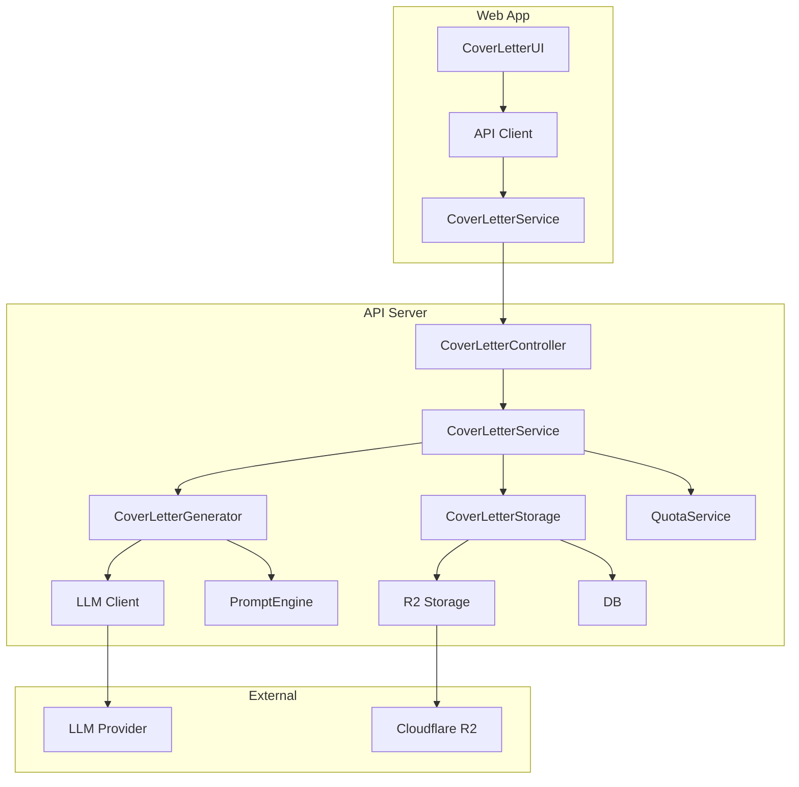
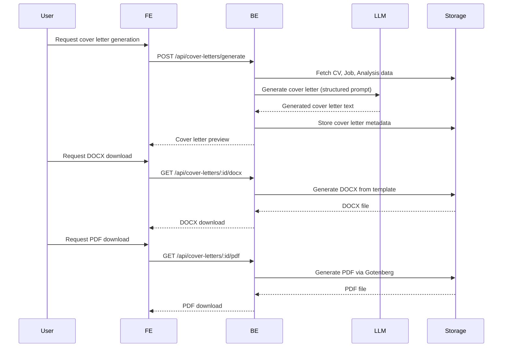

"Generate Cover Letter" button next to "Apply Suggestions" button

- `ApplicationTracker` - Add cover letter attachment functionality to applications
- `Dashboard` - Add "Recent Cover Letters" section to dashboard
- `SidebarNav` - Add "Cover Letters" menu item under "Applications"

### 7.2 UI Mockups

**Analysis Result Page (Post-Analysis):**

```
+-----------------------------------------------------+
| ANALYSIS RESULTS: 85/100 (Good Match)              |
|                                                     |
|  [Apply Suggestions]   [Generate Cover Letter]      |
|                                                     |
|  +-----------------------------------------------+  |
|  | COVER LETTER PREVIEW                          |  |
|  |                                               |  |
|  |  +----------------------------------------+   |  |
|  |  | [Polaroid Frame]                        |   |  |
|  |  |  Yogyakarta, 28 Juli 2026              |   |  |
|  |  |                                        |   |  |
|  |  |  Kepada Yth,                           |   |  |
|  |  |  HR Manager                            |   |  |
|  |  |  PT Teknologi Maju Indonesia           |   |  |
|  |  |                                        |   |  |
|  |  |  Dengan hormat,                        |   |  |
|  |  |  Saya menulis untuk melamar posisi...  |   |  |
|  |  |                                        |   |  |
|  |  |  [Signature]                           |   |  |
|  |  |  Budi Santoso                          |   |  |
|  |  +----------------------------------------+   |  |
|  |                                               |  |
|  |  [Download] [Edit] [Regenerate] [Save]         |  |
|  +-----------------------------------------------+  |
+-----------------------------------------------------+
```

## 8. Technical Architecture

### 8.1 System Components



### 8.2 Data Flow



## 9. Data Model

### 9.1 Prisma Schema Additions

```prisma
model CoverLetter {
  id            String   @id @default(cuid())
  userId        String
  cvId          String
  jobPostingId  String
  analysisId    String?

  // Content
  text          String   // Plain text content
  language      String   @default("id") // id|en
  template      String?  // Template/style used
  customInstructions String? // User-provided instructions

  // Metadata
  relevanceScore Int?    // 0-100, generated by AI
  wordCount      Int     // For length control

  // Storage keys for generated files
  docxKey       String?  // R2 key for DOCX file
  pdfKey        String?  // R2 key for PDF file

  // Timestamps
  createdAt     DateTime @default(now())
  updatedAt     DateTime @updatedAt

  // Relations
  user         User        @relation(fields: [userId], references: [id], onDelete: Cascade)
  cv           Cv          @relation(fields: [cvId], references: [id], onDelete: Cascade)
  jobPosting   JobPosting  @relation(fields: [jobPostingId], references: [id], onDelete: Cascade)
  analysis     Analysis?   @relation(fields: [analysisId], references: [id], onDelete: SetNull)
  applications Application[]

  @@index([userId])
  @@index([cvId])
  @@index([jobPostingId])
  @@map("cover_letter")
}
```

### 9.2 Schema Extensions

**User Model Extension:**

```prisma
model User {
  // ... existing fields ...

  // Cover letter quota
  coverLetterQuota          Int?      @default(3)
  coverLetterUsedThisPeriod Int       @default(0)
  coverLetterQuotaResetAt   DateTime?

  coverLetters CoverLetter[]

  // Quota reset logic (shared with analysis/interview)
  @@map("user")
}
```

## 10. API Endpoints

### 10.1 Cover Letter Endpoints

| Method | Endpoint                      | Description               | Auth | Quota |
| ------ | ----------------------------- | ------------------------- | ---- | ----- |
| POST   | `/api/cover-letters/generate` | Generate cover letter     | ✅   | ✅    |
| GET    | `/api/cover-letters`          | List user's cover letters | ✅   | ❌    |
| GET    | `/api/cover-letters/:id`      | Get cover letter details  | ✅   | ❌    |
| PUT    | `/api/cover-letters/:id`      | Update cover letter       | ✅   | ❌    |
| DELETE | `/api/cover-letters/:id`      | Delete cover letter       | ✅   | ❌    |
| GET    | `/api/cover-letters/:id/text` | Get plain text            | ✅   | ❌    |
| GET    | `/api/cover-letters/:id/docx` | Download DOCX             | ✅   | ❌    |
| GET    | `/api/cover-letters/:id/pdf`  | Download PDF              | ✅   | ❌    |

### 10.2 Request/Response Schemas

**Generate Cover Letter Request:**

```typescript
{
  cvId: string // Required
  jobPostingId: string // Required
  analysisId?: string // Optional (for auto-generate flow)
  language?: "id" | "en" // Optional (default: auto-detect)
  template?: string // Optional (default: "professional")
  customInstructions?: string // Optional
}
```

**Generate Cover Letter Response:**

```typescript
{
  id: string
  text: string
  language: "id" | "en"
  template: string
  relevanceScore: number // 0-100
  wordCount: number
  createdAt: string
  updatedAt: string

  // Related entities
  cv: CvDto
  jobPosting: JobDto
  analysis?: AnalysisDto
}
```

## 11. AI Pipeline

### 11.1 Prompt Engineering

**System Prompt:**

```
You are an expert career advisor and professional writer specializing in job applications. Your task is to generate personalized, compelling cover letters that:

1. Are tailored to specific job postings
2. Highlight the candidate's most relevant qualifications
3. Address any identified gaps strategically
4. Maintain absolute honesty (never fabricate experience)
5. Use professional yet engaging language
6. Follow standard cover letter structure

Guidelines:
- Use the provided CV content, job requirements, and analysis results as your ONLY source of information
- Never invent experience, skills, or achievements not present in the CV
- Address gaps by focusing on transferable skills or willingness to learn
- Adapt tone to job level (formal for senior roles, enthusiastic for entry-level)
- Keep length between 250-400 words
- Use clear, concise language with active voice
- Include keywords from job posting naturally
- For Indonesian cover letters, use formal business language
- For English cover letters, use professional international business language

Structure:
1. Header with date and recipient info
2. Salutation
3. Opening paragraph (position applying for, how you learned about it)
4. Body paragraph(s) (relevant experience, skills, achievements)
5. Closing paragraph (enthusiasm, call to action)
6. Signature
```

**User Prompt Structure:**

```
Generate a cover letter in [LANGUAGE] using the [TEMPLATE] template for the following:

**Job Posting:**
[Job title] at [Company]
[Job requirements]
[Must-have skills]
[Nice-to-have skills]

**Candidate CV:**
[Full name]
[Headline]
[About section]
[Skills]
[Relevant experiences]
[Education]

**Analysis Results (if available):**
Match score: [score]/100
Gaps identified: [list of gaps with types]
Suggestions: [relevant suggestions]

**Custom Instructions (if provided):**
[User instructions]

**Additional Context:**
Job level: [entry-level/mid-level/senior]
Industry: [industry]
```

### 11.2 Post-Processing

1. **Validation:** Ensure cover letter meets length requirements (250-400 words)
2. **Fact-Checking:** Verify all claims are supported by CV content
3. **Keyword Analysis:** Check for inclusion of job posting keywords
4. **Relevance Scoring:** Generate 0-100 relevance score based on job requirements
5. **Formatting:** Apply selected template formatting
6. **DOCX Generation:** Convert to DOCX using template with proper styling
7. **PDF Generation:** Convert DOCX to PDF via Gotenberg for pixel-perfect output

## 12. Quota & Monetization

### 12.1 Quota System

| Plan    | Monthly Quota | Overages | Reset Period |
| ------- | ------------- | -------- | ------------ |
| Free    | 3 generations | Blocked  | Monthly      |
| Premium | Unlimited     | N/A      | N/A          |

### 12.2 Quota Tracking

- Track cover letter generations per user
- Reset quota on monthly anniversary of account creation
- Show quota usage in UI (e.g., "2/3 free generations remaining this month")
- Premium users see "Unlimited" instead of quota counter
- Quota enforcement at generation time (not at download time)

## 13. i18n

### 13.1 Language Support

| Language        | Status          | Notes                                  |
| --------------- | --------------- | -------------------------------------- |
| Indonesian (id) | ✅ Full support | Default for Indonesian job postings    |
| English (en)    | ✅ Full support | Default for international job postings |

### 13.2 Language Detection

- Auto-detect language from job posting text
- Fallback to user's UI language preference
- Allow manual override in UI
- Store language with each cover letter

### 13.3 Localization Keys

**New i18n Keys:**

```json
{
  "coverLetter": {
    "title": {
      "id": "Surat Lamaran",
      "en": "Cover Letter"
    },
    "generate": {
      "id": "Buat Surat Lamaran",
      "en": "Generate Cover Letter"
    },
    "preview": {
      "id": "Pratinjau Surat Lamaran",
      "en": "Cover Letter Preview"
    },
    "quota": {
      "id": "{{count}}/{{quota}} gratis bulan ini",
      "en": "{{count}}/{{quota}} free this month"
    },
    "quotaExceeded": {
      "id": "Kuota surat lamaran gratis Anda telah habis. Tingkatkan ke premium untuk buat tanpa batas.",
      "en": "You've used all your free cover letter generations. Upgrade to premium for unlimited generations."
    },
    "templates": {
      "professional": {
        "id": "Profesional",
        "en": "Professional"
      },
      "modern": {
        "id": "Modern",
        "en": "Modern"
      },
      "creative": {
        "id": "Kreatif",
        "en": "Creative"
      }
    }
  }
}
```

## 14. Output Format

### 14.1 Plain Text

- UTF-8 encoded text
- Standard cover letter structure
- No special formatting
- Suitable for copy-paste into web forms

### 14.2 DOCX

- Generated using docx-templates library
- Professional formatting with:
  - Company letterhead (if available)
  - Proper margins and spacing
  - Professional fonts (matching CV)
  - Signature area
- Preserves all text content
- Editable by user

### 14.3 PDF

- Generated via Gotenberg (DOCX → PDF conversion)
- Pixel-perfect rendering of DOCX template
- Non-editable (final version)
- Professional print-ready format

## 15. Edge Cases & Error Handling

| Scenario                    | Handling                                            |
| --------------------------- | --------------------------------------------------- |
| Quota exceeded              | Show upgrade prompt, block generation               |
| Missing CV content          | Fallback to raw text, warn user                     |
| Missing job content         | Require manual input, warn user                     |
| LLM generation failure      | Retry once, then show error with manual option      |
| DOCX generation failure     | Offer text download instead                         |
| PDF generation failure      | Offer DOCX download instead                         |
| Large CV/job text           | Truncate with warning, prioritize recent experience |
| Language detection failure  | Fallback to user language preference                |
| Cover letter too short/long | Auto-adjust, warn user                              |
| Invalid custom instructions | Sanitize, warn user about ignored content           |

## 16. Testing Strategy

### 16.1 Unit Tests

- **Prompt Engineering:** Test prompt templates with various input combinations
- **Validation:** Test length validation, fact-checking logic
- **Quota:** Test quota enforcement and reset logic
- **Language Detection:** Test language detection accuracy
- **Relevance Scoring:** Test scoring algorithm consistency

### 16.2 Integration Tests

- **Generation Flow:** Test end-to-end generation with mock LLM
- **Format Conversion:** Test DOCX and PDF generation
- **API Endpoints:** Test all cover letter endpoints
- **Quota Integration:** Test quota enforcement in API

### 16.3 E2E Tests

- **Auto-generate Flow:** Test cover letter generation from analysis results
- **Standalone Wizard:** Test full wizard flow
- **Cover Letter Management:** Test CRUD operations
- **Format Downloads:** Test text, DOCX, and PDF downloads
- **Mobile Responsiveness:** Test on mobile devices

### 16.4 AI Evaluation

- **Human Review:** Manual review of generated cover letters for quality
- **A/B Testing:** Compare different prompt versions
- **Bias Testing:** Ensure no demographic bias in generated content
- **Hallucination Testing:** Verify no fabricated experience

## 17. Success Metrics

| Metric             | Target                   | Measurement                                                  |
| ------------------ | ------------------------ | ------------------------------------------------------------ |
| Adoption Rate      | 40% of active users      | % of users who generate ≥1 cover letter in first month       |
| Generation Volume  | 5 generations/user/month | Average generations per active user                          |
| Premium Conversion | 15% of free users        | % of free users who upgrade after quota exhaustion           |
| Time Saved         | 25 minutes/generation    | User survey                                                  |
| Quality Score      | 4.2/5                    | User rating of generated cover letters                       |
| Interview Rate     | 20% increase             | % of applications with cover letters that lead to interviews |
| Retention          | 30% month-over-month     | % of users who generate cover letters in consecutive months  |

## 18. Timeline

| Phase                | Duration    | Deliverables                             |
| -------------------- | ----------- | ---------------------------------------- |
| Planning             | 3 days      | PRD, technical design, UI mockups        |
| Backend Development  | 5 days      | API endpoints, AI pipeline, quota system |
| Frontend Development | 5 days      | UI components, wizard flow, integration  |
| Testing              | 3 days      | Unit tests, integration tests, E2E tests |
| AI Training          | 2 days      | Prompt refinement, quality evaluation    |
| Deployment           | 1 day       | Production rollout, monitoring setup     |
| **Total**            | **19 days** | **Full feature release**                 |

## 19. Risks & Mitigations

| Risk                      | Impact                      | Mitigation                                          |
| ------------------------- | --------------------------- | --------------------------------------------------- |
| Low adoption              | Wasted development effort   | Market research, gradual rollout, user education    |
| High LLM costs            | Increased operational costs | Cost control, caching, quota limits                 |
| Poor quality output       | Negative user experience    | Human review, prompt refinement, user feedback loop |
| Format conversion issues  | User frustration            | Robust error handling, fallback options             |
| Quota system abuse        | Revenue loss                | Rate limiting, fraud detection                      |
| Language detection errors | Poor user experience        | Fallback mechanisms, manual override                |
| Integration complexity    | Development delays          | Modular architecture, clear interfaces              |

## 20. Open Questions

1. Should we allow users to upload their own cover letter templates?
2. Should we offer a "cover letter review" feature for user-written cover letters?
3. Should we integrate with LinkedIn Easy Apply for one-click applications?
4. Should we offer team/collaboration features for cover letters?
5. Should we provide analytics on cover letter performance (e.g., open rates)?

## 21. Appendix

### 21.1 Cover Letter Templates

**Template 1: Professional (Default)**

- Classic business format
- Formal tone
- Standard structure
- Suitable for corporate roles

**Template 2: Modern**

- Clean, contemporary layout
- Slightly more engaging tone
- Bullet points for key achievements
- Suitable for tech startups

**Template 3: Creative**

- More visually distinctive
- Storytelling approach
- Suitable for creative industries

### 21.2 Example Outputs

**Indonesian Example:**

```
Yogyakarta, 28 Juli 2026

Kepada Yth,
HR Manager
PT Teknologi Maju Indonesia

Dengan hormat,

Saya menulis untuk melamar posisi Frontend Developer di PT Teknologi Maju Indonesia seperti yang diiklankan di LinkedIn. Sebagai lulusan Ilmu Komputer UGM dengan pengalaman 3 tahun dalam pengembangan aplikasi web modern, saya sangat tertarik untuk bergabung dengan tim Anda.

Dalam peran saya saat ini sebagai Frontend Developer di Tokopedia, saya telah:
- Mengembangkan fitur utama menggunakan React, TypeScript, dan Tailwind CSS
- Meningkatkan performa aplikasi sebesar 40% melalui optimasi kode
- Memimpin tim kecil untuk mengimplementasikan design system baru
- Berkolaborasi dengan backend dan UX tim untuk menghasilkan solusi terintegrasi

Analisis Dilirik menunjukkan bahwa CV saya memiliki kecocokan 85% dengan lowongan ini. Saya telah memastikan untuk menyoroti pengalaman saya yang paling relevan dengan persyaratan posisi ini, termasuk:
- Penguasaan React dan TypeScript (persyaratan utama)
- Pengalaman dengan Tailwind CSS (persyaratan utama)
- Kemampuan bekerja dalam tim lintas fungsi (persyaratan utama)

Meskipun saya belum memiliki pengalaman langsung dengan Next.js yang disebutkan dalam lowongan, saya telah bekerja dengan framework serupa dan yakin dapat dengan cepat mempelajari teknologi ini. Saya sangat antusias dengan kesempatan untuk membawa keahlian saya ke PT Teknologi Maju Indonesia dan berkontribusi pada proyek-proyek inovatif Anda.

Saya akan sangat senang untuk mendiskusikan bagaimana kualifikasi saya dapat mendukung tim Anda. Terima kasih atas waktu dan pertimbangannya. Saya berharap dapat segera mendengar kabar dari Anda.

Hormat saya,
Budi Santoso
```

**English Example:**

```
July 28, 2026

Hiring Manager
Gojek

Dear Hiring Manager,

I am excited to apply for the Data Analyst position at Gojek as advertised on your careers page. With a degree in Statistics from UI and two years of experience analyzing complex datasets, I am eager to bring my analytical skills to your data science team.

In my current role as Junior Data Analyst at Traveloka, I have:
- Designed and implemented dashboards that reduced reporting time by 50%
- Conducted A/B tests that improved user engagement by 25%
- Automated data pipelines, saving 15 hours/week of manual work
- Presented insights to senior management that informed product decisions

The Dilirik analysis shows my CV matches 72% of this job's requirements. I've tailored my application to highlight:
- SQL expertise (core requirement)
- Python for data analysis (core requirement)
- Experience with large datasets (core requirement)
- Business acumen and communication skills (nice-to-have)

While my experience with Tableau is more extensive than Power BI as mentioned in the job posting, I have completed online training in Power BI and am confident in my ability to quickly become proficient. I am particularly drawn to this opportunity at Gojek because of your innovative approach to data-driven decision making in the Southeast Asian market.

I would welcome the opportunity to discuss how my skills and experiences align with your needs. Thank you for your time and consideration. I look forward to the possibility of contributing to Gojek's continued success.

Best regards,
Anita Wijaya
```
